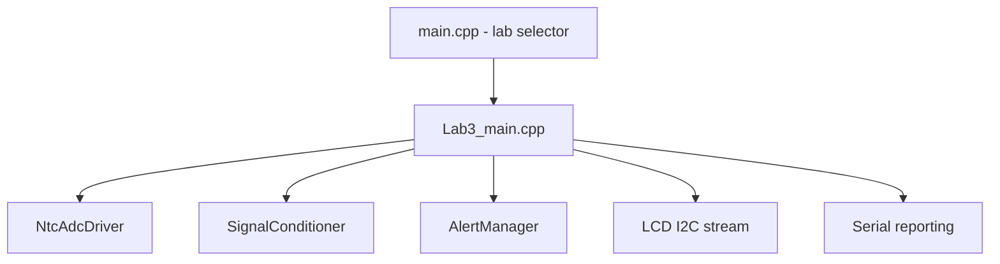
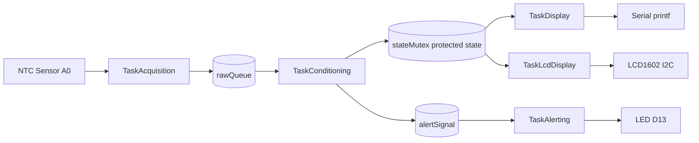
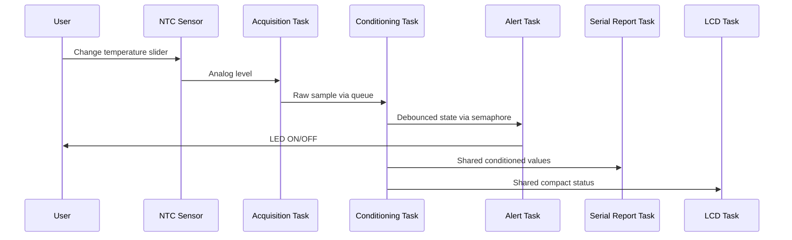
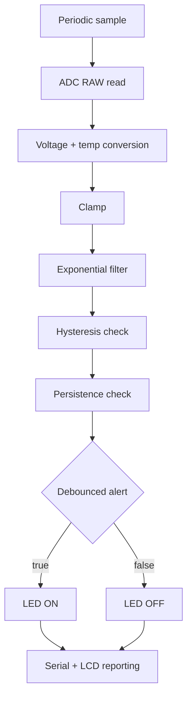
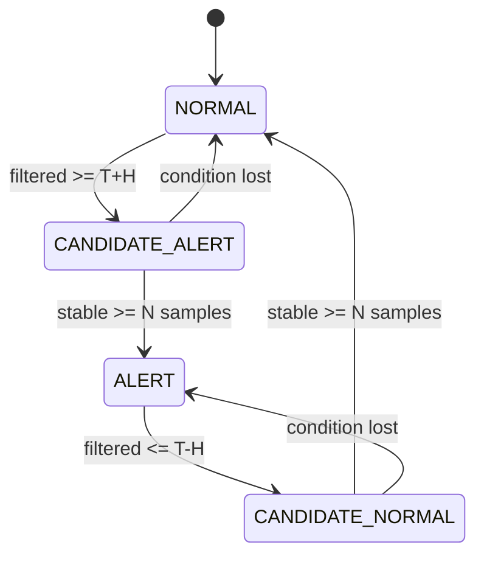

# Laboratory Report - Lab 2.1
## Multitasking with Operating Systems

1. Domain Analysis

a. Purpose of the laboratory work
The laboratory work aims to familiarize with fundamental concepts of operating systems for embedded electronic systems and their use in microcontroller applications. The target is to build an application that runs sequentially or concurrently multiple tasks (bare-metal or RTOS), while demonstrating scheduling, synchronization (producer/consumer model), and execution behavior (preemptive or non-preemptive), with clear software architecture and data-flow documentation.

b. Objectives of the laboratory work
- Familiarize with scheduling and execution principles for tasks in embedded systems, both sequential and concurrent.
- Understand and apply recurrences and offsets for processor utilization optimization.
- Implement synchronization and communication mechanisms between tasks, including producer/consumer and buffer usage.
- Analyze advantages and limitations of sequential versus preemptive multitasking.
- Document software architecture using block diagrams and electrical schematics.

c. Problem definition
Design and implement a microcontroller-based smart lock system with menu-driven control, password management, and status reporting using keypad input, LCD output, and LED feedback.

Functional specifications:
- FR-1.0: Command Interface
- FR-1.1: The system shall accept `*` key to enter menu mode.
- FR-1.2: The system shall display menu options after menu entry: `0:Lock *1:Unlock *2:ChgPass *3:Stat`.
- FR-1.3: The system shall accept `#` key to execute selected command.
- FR-2.0: Lock/Unlock Operations
- FR-2.1: Command `0` shall unconditionally change lock state to `LOCKED`.
- FR-2.2: Command `1` shall request password input before unlocking.
- FR-2.3: System shall compare entered password with stored password (case-sensitive).
- FR-2.4: Correct password shall change state to `UNLOCKED`; incorrect password shall keep `LOCKED` and display error.
- FR-3.0: Password Management
- FR-3.1: Command `2` shall initiate password change sequence.
- FR-3.2: System shall request old password, then new password.
- FR-3.3: Password updates only if old password matches.
- FR-3.4: Password storage is non-volatile for this implementation scope (static memory).
- FR-4.0: Status Display
- FR-4.1: Command `3` shall display current lock status (`LOCKED`/`OPEN`).
- FR-4.2: Status display shall return to menu after completion.
- FR-5.0: User Feedback
- FR-5.1: LCD shall display current prompt/state on 2-line display.
- FR-5.2: User input shall be echoed to LCD during entry.
- FR-5.3: Operation results shall be displayed (success/error).
- FR-5.4: Green LED shall illuminate for 1 second on successful operations.
- FR-5.5: Red LED shall illuminate for 1 second on errors/failures.
- FR-5.6: Feedback timing shall be non-blocking.

Non-functional specifications:
- NFR-1.0: Performance
- NFR-1.1: System response latency shall be below 100 ms (target below 50 ms).
- NFR-1.2: Keypad debounce delay shall be 20 ms +/- 5 ms.
- NFR-1.3: LED feedback duration shall be 1000 ms +/- 100 ms.
- NFR-1.4: Real-time scheduling without blocking delays in interactive mode.
- NFR-2.0: Reliability
- NFR-2.1: System shall not miss valid key presses.
- NFR-2.2: Password comparison shall be exact and case-sensitive.
- NFR-2.3: FSM shall prevent invalid transitions.
- NFR-2.4: System shall recover from invalid input without data loss.
- NFR-3.0: Resource Efficiency
- NFR-3.1: RAM usage shall remain below 40% (less than 819 bytes).
- NFR-3.2: Flash usage shall remain below 50% (less than 16 KB).
- NFR-3.3: No dynamic memory allocation in critical paths.
- NFR-3.4: LEDs off by default.
- NFR-4.0: Maintainability
- NFR-4.1: Code shall be organized in modular drivers (ECAL) and FSM (SRV).
- NFR-4.2: Hardware layer (MCAL) shall be isolated from business logic.
- NFR-4.3: Modules shall expose clear public interfaces.
- NFR-4.4: Comments shall explain non-obvious logic.
- NFR-5.0: Scalability
- NFR-5.1: Drivers shall be reusable across projects.
- NFR-5.2: FSM shall be extensible for extra operations.
- NFR-5.3: Pin assignments shall be configurable.
- NFR-5.4: Password length shall be configurable (currently 10 bytes maximum).

System constraints:
- Platform: Arduino Uno (ATmega328P, 16 MHz, 2 KB RAM, 32 KB Flash).
- Input: 4x4 matrix keypad (16 keys).
- Display: 16x2 LCD (HD44780-compatible).
- Output indicators: red LED (error), green LED (success).
- Development tools: PlatformIO, VS Code, Wokwi.

d. Description of technologies used and context
The system follows a finite state machine (FSM) architecture, with distinct states such as `MENU`, `LOCKED`, `UNLOCKED`, `INPUT`, and `ERROR`. Transitions depend on keypad events and password validation outcomes, giving deterministic behavior and clear state traceability.

Input is acquired through a 4x4 matrix keypad (4 rows, 4 columns, 8 GPIO lines). Scanning activates one row at a time and reads columns to identify pressed keys. To reduce switch bounce effects, software debounce with approximately 20 ms confirmation is applied.

The implementation is event-driven and non-blocking, using `millis()` instead of `delay()`, enabling continuous keypad polling, LED timing updates, and state processing. The LCD 16x2 HD44780 in 4-bit mode provides user prompts and operation results.

e. Presentation of hardware and software components and roles
Hardware:
- Arduino Uno (ATmega328P, 16 MHz): central controller executing FSM and drivers.
- 4x4 keypad: command and password input.
- 16x2 LCD: menu, prompts, and status messages.
- Red and green LEDs with 220 ohm resistors: error/success feedback.
- Breadboard and jumper wiring powered via USB.

Software:
- Visual Studio Code with PlatformIO.
- Arduino framework for hardware abstraction.
- `Keypad` and `LiquidCrystal` libraries for keypad/LCD interfacing.
- Driver modules and FSM service layer for modular organization.

f. System architecture explanation and justification of the solution
The architecture is layered and modular:
- Application layer handles command interpretation and flow control.
- Driver layer encapsulates peripherals (LED, serial STDIO, keypad, LCD).
- Hardware abstraction layer (Arduino framework/MCAL) interfaces with low-level pins and registers.

This separation improves maintainability, scalability, and reuse. Redirected STDIO over serial is justified by structured formatting and easier diagnostics compared with ad-hoc serial prints.

g. Definition of test scenarios and validation criteria
Test scenarios are grouped as:
- Functional validation: menu navigation, lock/unlock, password change, status display.
- Non-functional validation: latency, debounce timing, LED timing.
- Behavioral validation: FSM transitions and error handling.
- Edge-case validation: invalid commands, empty input, rapid key sequences.

Validation criteria include:
- Functional correctness of command-to-state transitions.
- Timing checks (`millis()`-based) for response and LED intervals.
- Reliability checks during continuous operation.
- Memory/resource checks via build reports.
- Manual FSM path traversal to ensure no invalid transitions are possible.

h. Technological context and industry relevance
Smart-lock principles map directly to:
- Home automation access systems.
- Office/commercial access control.
- IoT authentication endpoints.
- Industrial safety lockout workflows.

The laboratory implementation demonstrates core patterns used in production systems: FSM-driven control, user feedback loops, deterministic timing, and modular embedded design.

i. Relevant case study demonstrating applicability
Comparable architectures are used in:
- Smart-home keypad locks (PIN, status indication, state/event logging).
- Office entry systems with deterministic access-state handling.
- Automotive lock/unlock subsystems with strict latency and stable transitions.

2. System Design

The modular implementation respects interface/implementation separation (`.h` for contracts, `.cpp` for logic). The following diagrams are preserved.

Figure 1: Structure of laboratory work


Figure 2: Architecture schema


Figure 3: User interaction


Figure 4: Activity diagram


Figure 5: State diagram for alert logic


Figure 6: Sequence diagram of one processing cycle
```mermaid
sequenceDiagram
    participant A as TaskAcquisition
    participant Q as rawQueue
    participant C as TaskConditioning
    participant S as SharedState
    participant G as alertSignal
    participant L as TaskAlerting
    participant R as TaskDisplay

    A->>Q: xQueueOverwrite(sample)
    C->>Q: xQueueReceive()
    C->>S: lock stateMutex; update values; unlock
    C->>G: xSemaphoreGive()
    L->>G: xSemaphoreTake()
    L->>S: read debouncedAlert
    L->>L: apply LED state
    R->>S: periodic snapshot and printf table
```

Figure 7: Modeled electronic schema
- Arduino Mega
- NTC sensor: VCC/GND/OUT->A0
- LED: D13
- LCD1602 I2C: VCC/GND/SDA/SCL

Figure 8: Behavior diagrams for each peripheral

```mermaid
gantt
    title Periodic task recurrences (Lab3)
    dateFormat X
    axisFormat %Lms

    section Acquisition
    sample every 50ms :a1, 0, 400

    section Conditioning
    run every 50ms :c1, 0, 400

    section Alerting
    run every 50ms :al1, 0, 400

    section LCD
    refresh every 500ms :l1, 0, 1000

    section Serial report
    refresh every 1000ms :r1, 0, 2000
```


3. Results

The smart-lock system was validated in PlatformIO and Wokwi simulation, with confirmation on hardware behavior. On startup, the LCD shows the initial state and waits for `*`. After entering menu mode, operations `0` to `3` produce expected LCD messages and LED feedback according to lock status and password outcome.

Table 1: Testing requirements

| ID | Test category | Test description | Expected result |
|---|---|---|---|
| T1 | Initialization | Power on system | LCD shows initial message; state `LOCKED`; Red LED ON, Green LED OFF |
| T2 | Lock Operation | Execute `*0#` | LCD displays lock message; Red LED active; state `LOCKED` |
| T3 | Unlock (Valid) | Enter correct password | LCD shows access granted; Green LED active; state `UNLOCKED` |
| T4 | Unlock (Invalid) | Enter wrong password | LCD shows error; Red LED active; state remains `LOCKED` |
| T5 | Change Password (Valid) | Correct old password + new password | Password updated; success feedback on LCD and Green LED |
| T6 | Change Password (Invalid) | Wrong old password | Password unchanged; LCD error and Red LED feedback |
| T7 | Status Display | Execute `*3#` | LCD displays current lock status correctly |
| T8 | LED Feedback Timing | Trigger success and error operations | Correct LED turns on for approximately 1 second |
| T9 | Keypad and LCD Response | Press keys rapidly | No duplicated/missed inputs; prompt updates remain coherent |
| T10 | Reliability | Repeated operation over time | No crashes or abnormal behavior |

4. Conclusions

The implemented smart-lock system satisfies the laboratory objectives for embedded input processing, state-based control, and output feedback management. The application provides lock/unlock control, password change, and status reporting through a modular architecture with clear separation between input handling, state logic, and peripheral drivers.

The solution is functional and maintainable under resource constraints of Arduino-class hardware. Future improvements can include EEPROM-backed password persistence, stricter non-blocking timing for all flows, and additional security features (for example retry limits and audit logging).

During report preparation, AI-based assistance tools were used for drafting and formatting support; technical content was reviewed and aligned to laboratory requirements.

Bibliography
[1] R. L. Boylestad and L. Nashelsky, Electronic Devices and Circuit Theory, 11th ed., Pearson, 2013.
[2] J. G. Ganssle, The Art of Designing Embedded Systems, 2nd ed., Elsevier, 2007.
[3] M. Barr, Embedded C Programming and the Atmel AVR, 2nd ed., Newnes, 2006.
[4] Arduino Mega 2560 Documentation, https://docs.arduino.cc/hardware/mega-2560/
[5] Wokwi Documentation, https://docs.wokwi.com/
[6] Project repository, https://github.com/danganhuh/ES_labs
