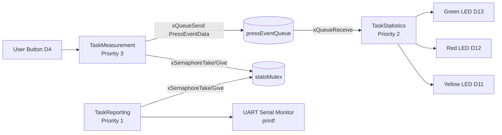
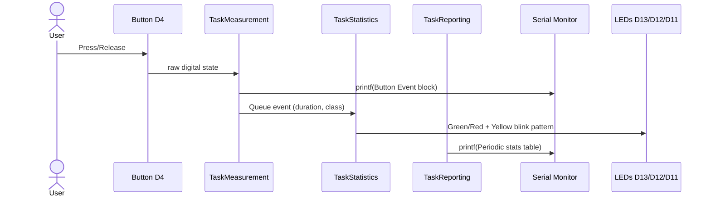
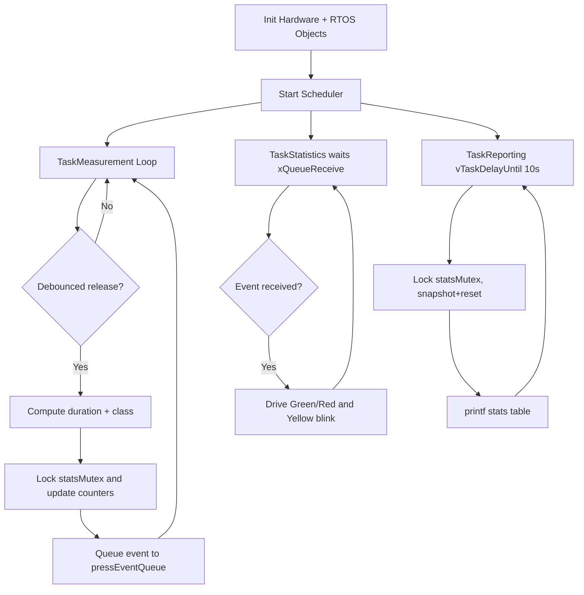
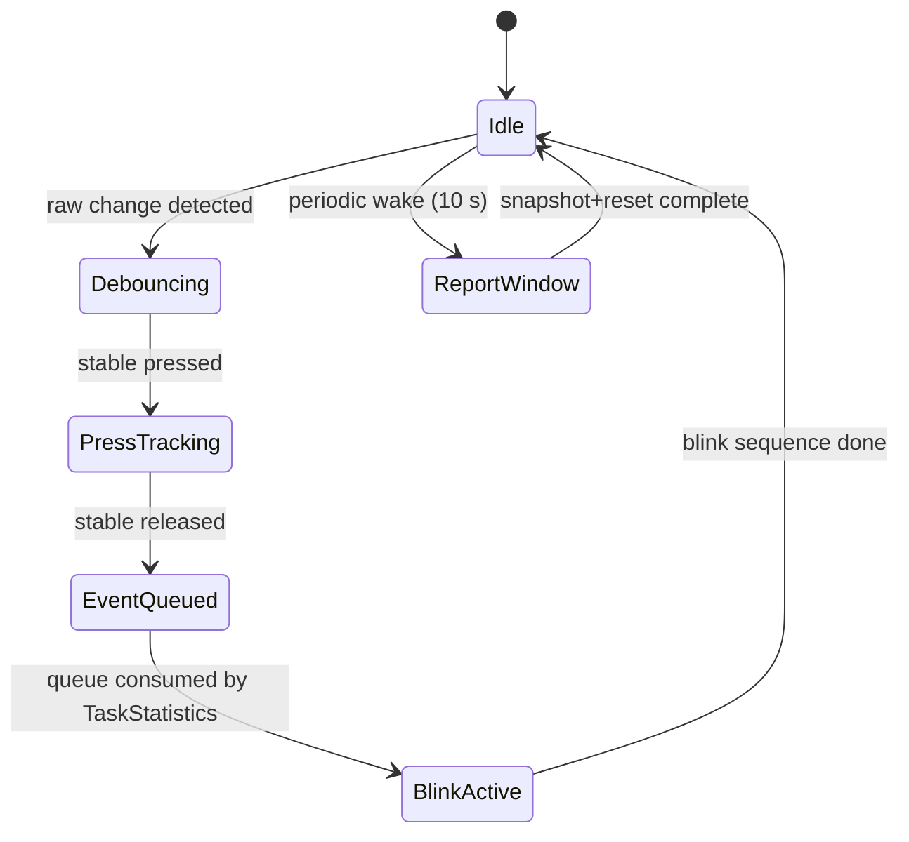
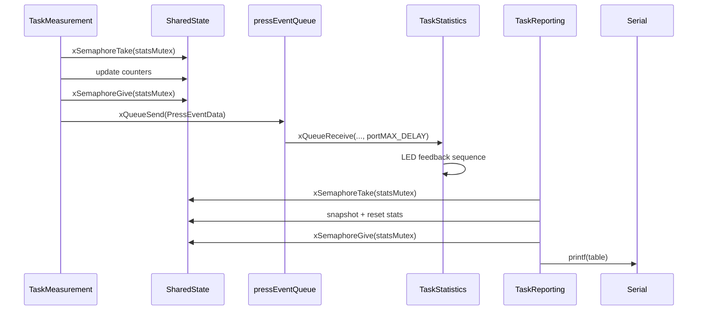

1.	Domain Analysis
a.	Purpose of the laboratory work
Familiarization with the fundamental concepts of real-time operating systems for embedded electronic systems, and with their practical implementation for microcontroller applications using FreeRTOS. The laboratory work aims to develop an application that executes multiple tasks under a preemptive real-time scheduler, using FreeRTOS primitives such as binary semaphores, mutexes, and task priorities. The implementation must clearly demonstrate preemptive multitasking methodology, inter-task synchronization via RTOS primitives, and deterministic timing based on FreeRTOS tick-driven delays. Complete software architecture documentation using standard C and printf/scanf UART stdio redirection is required.

b.	Objectives of the laboratory work
-	Familiarize with task scheduling and execution principles in an embedded system, with focus on preemptive multitasking using FreeRTOS on AVR.
-	Understand and apply FreeRTOS task creation, priorities, and stack allocation for deterministic execution order.
-	Implement synchronization and communication mechanisms between tasks using binary semaphores (event notification) and mutexes (data protection).
-	Utilize standard C I/O (printf for serial output, scanf for serial input) through UART stdio redirection on AVR.
-	Analyze practical advantages and limitations of FreeRTOS preemptive scheduling for resource-constrained MCUs.
-	Document software architecture, timing diagrams, and hardware/software interfaces used in Lab2_2.

c.	Problem definition
Design and implement a microcontroller-based button duration monitor that uses FreeRTOS preemptive scheduling to process three concurrent tasks: button event detection and debouncing, statistics accumulation with multi-LED feedback, and periodic reporting through printf over serial STDIO. User configuration of the short/long threshold is provided via scanf at startup.
Functional specifications:
FR-1.0: RTOS Scheduler Interface
FR-1.1: System shall use FreeRTOS preemptive scheduler with configurable tick rate.
FR-1.2: Scheduler shall manage three tasks with distinct priorities (Measurement=3, Statistics=2, Reporting=1).
FR-1.3: Each task shall have a dedicated stack (512 words) allocated at creation.
FR-1.4: Task execution shall be preemptive; higher-priority tasks interrupt lower-priority ones.
FR-2.0: Button Monitoring (TaskMeasurement, Priority 3)
FR-2.1: TaskMeasurement shall poll the button pin every tick via vTaskDelay(1) and apply software debouncing.
FR-2.2: On confirmed release, system shall measure last press duration in ms using hw_millis().
FR-2.3: Press duration shall be classified SHORT or LONG based on a user-configurable threshold (default 500 ms) read via scanf at startup.
FR-2.4: TaskMeasurement shall publish event data through a mutex-protected shared struct and signal TaskStatistics via a binary semaphore.
FR-2.5: TaskMeasurement shall print event classification and duration using printf.
FR-3.0: Statistics and LED Feedback (TaskStatistics, Priority 2)
FR-3.1: TaskStatistics shall block on a binary semaphore until a press event is signaled by TaskMeasurement.
FR-3.2: System shall maintain total, short, and long press counters plus accumulated duration, protected by a mutex.
FR-3.3: SHORT press shall light green LED (D13) and trigger 5 yellow LED blinks (250 ms on / 250 ms off each).
FR-3.4: LONG press shall light red LED (D12) and trigger 10 yellow LED blinks (250 ms on / 250 ms off each).
FR-3.5: LED feedback timing shall use vTaskDelay with pdMS_TO_TICKS for accurate RTOS-based delays.
FR-4.0: Periodic Reporting (TaskReporting, Priority 1)
FR-4.1: TaskReporting shall run every 10000 ms using vTaskDelayUntil for precise periodic execution.
FR-4.2: System shall print total, short, long, and average press duration via printf.
FR-4.3: Statistics shall be reset after each report window using mutex-protected access.
FR-5.0: User Feedback and Diagnostics
FR-5.1: System shall output startup status and diagnostics through printf over serial STDIO.
FR-5.2: System shall perform LED self-test at startup (green, red, yellow, 300 ms each) and print PASS/progress.
FR-5.3: System shall read short/long threshold from user via scanf at startup.
FR-5.4: All LEDs shall remain OFF when no blink sequence is active.

Non-functional specifications:
NFR-1.0: Performance
NFR-1.1: FreeRTOS tick period shall be determined by configFREERTOS settings (default ~15 ms on AVR port).
NFR-1.2: Debounce requires 2 consecutive matching samples at the task tick rate.
NFR-1.3: Yellow LED blink timing shall be 250 ms on + 250 ms off per blink (500 ms for SHORT total, 1000 ms for LONG total via vTaskDelay).
NFR-1.4: All inter-task blocking shall use FreeRTOS semaphore/mutex primitives; no busy-wait loops in runtime tasks.
NFR-2.0: Reliability
NFR-2.1: System shall avoid duplicate press events caused by switch bounce via debounce state machine.
NFR-2.2: Binary semaphore shall ensure event-driven synchronization between TaskMeasurement and TaskStatistics without polling.
NFR-2.3: Mutexes shall protect shared PressEventData and PressStats structures against concurrent access.
NFR-2.4: Statistics shall remain coherent across each 10-second reporting window through mutex-guarded reset.
NFR-2.5: System shall sustain repeated operation without task starvation, deadlock, or scheduler loss.
NFR-3.0: Resource Efficiency
NFR-3.1: RAM usage shall remain within target MCU limits (8KB on ATmega2560).
NFR-3.2: Flash usage shall remain within target MCU limits (256KB on ATmega2560).
NFR-3.3: FreeRTOS heap allocation shall succeed for all three tasks, three synchronization primitives, and idle task.
NFR-3.4: printf/scanf shall use avr-libc fdev_setup_stream UART redirection (no dynamic allocation).
NFR-4.0: Maintainability
NFR-4.1: Code shall be written in standard C (.c files) with C-callable hardware wrappers in a C++ bridge (main.cpp).
NFR-4.2: Shared state types and pin assignments shall be centralized in Lab2_2_Shared.h.
NFR-4.3: Each task shall be in its own source file (MeasurementTask.c, StatisticsTask.c, ReportingTask.c).
NFR-4.4: Non-obvious logic (debouncing, semaphore signaling, mutex guarding) shall be documented in code comments.
NFR-5.0: Scalability
NFR-5.1: FreeRTOS task table is extensible; additional tasks can be created with xTaskCreate.
NFR-5.2: Short/long threshold is configurable at startup via scanf (stored in SharedState).
NFR-5.3: GPIO pin assignments shall be configurable via #define constants in Lab2_2_Shared.h.
NFR-5.4: Reporting format shall support extension with additional metrics via printf format strings.

System Constraints:
- Platform: ATmega2560 (16MHz, 8KB RAM, 256KB Flash) or Arduino Mega 2560
- RTOS: FreeRTOS (Arduino_FreeRTOS library, preemptive port for AVR)
- Input device: Push-button on D4 (INPUT_PULLUP, active-low)
- Output indicators: Green LED on D13, Red LED on D12, Yellow LED on D11 (each with appropriate resistor)
- Communication: Serial STDIO (UART) at 9600 baud, redirected via fdev_setup_stream for printf/scanf
- Development tools: PlatformIO IDE, VS Code, Wokwi simulator

d.	Description of the Technologies Used and the Context
The Lab2_2 implementation is structured as a preemptive multitasking application using FreeRTOS on an AVR microcontroller. Three tasks execute concurrently under the FreeRTOS scheduler: TaskMeasurement (highest priority) polls and debounces the button, TaskStatistics (medium priority) waits on a binary semaphore for press events and drives LED feedback, and TaskReporting (lowest priority) prints periodic statistics every 10 seconds using vTaskDelayUntil.
User input is acquired through a debounced push-button connected to D4. The task polls the pin every FreeRTOS tick and confirms state transitions after consecutive stable readings, mitigating mechanical bounce effects. On release, press duration is computed and classified into SHORT/LONG categories based on a user-configurable threshold entered via scanf at startup. Event data is published through a mutex-protected shared structure and signaled to the consumer task via a binary semaphore.
The system uses standard C I/O functions: printf for all serial output (diagnostics, event logs, periodic reports) and scanf for startup configuration. These are enabled through avr-libc's fdev_setup_stream, which redirects stdout and stdin to the UART. This approach demonstrates portable C I/O integration in an RTOS environment.
Inter-task communication follows a producer/consumer pattern with explicit RTOS synchronization. TaskMeasurement (producer) writes event data under mutex protection and gives a binary semaphore. TaskStatistics (consumer) blocks on the semaphore, reads data under mutex, updates statistics under a second mutex, and drives LED feedback using vTaskDelay-based timing. TaskReporting reads and resets statistics under the same mutex at fixed intervals.

e.	Presentation of Hardware and Software Components and Their Roles
The system targets an ATmega2560-based board (Arduino Mega 2560, 16 MHz), which provides sufficient RAM (8KB) for FreeRTOS task stacks and heap. Input is provided by a single push-button connected to D4 in active-low configuration with internal pull-up. Visual output is provided by three LEDs: green on D13 (short press indicator), red on D12 (long press indicator), and yellow on D11 (blink count feedback), each connected through current-limiting resistors. The circuit is assembled on breadboard with jumper wires and powered by USB.
Software development is performed in Visual Studio Code with PlatformIO. The Arduino framework provides hardware abstraction APIs. The FreeRTOS library (Arduino_FreeRTOS) provides the preemptive scheduler, task management, semaphores, and mutexes. Since FreeRTOS and Arduino.h are C++, while the application tasks are written in pure C, a bridge layer in main.cpp provides extern "C" wrapper functions (hw_pin_mode, hw_digital_read, hw_digital_write, hw_millis, hw_delay_ms) for hardware access. Standard C printf/scanf are redirected to UART via fdev_setup_stream. Testing and validation are performed in both Wokwi simulation and physical hardware.

f.	System Architecture Explanation and Justification of the Solution
The system architecture follows a layered modular approach. The application layer consists of three FreeRTOS task functions in separate C source files (MeasurementTask.c, StatisticsTask.c, ReportingTask.c) plus the setup/initialization in Lab2_2_main.c. The bridge layer (main.cpp) provides extern "C" hardware wrappers and UART stdio redirection. The RTOS layer (FreeRTOS) provides scheduling, synchronization, and timing. The hardware abstraction layer (Arduino framework + AVR registers) provides GPIO, serial, and timer control.
Using FreeRTOS preemptive scheduling is justified by the need to demonstrate real-time multitasking concepts: priority-based preemption, semaphore-based event signaling, and mutex-based data protection. Unlike the bare-metal cyclic scheduler of Lab2_1, FreeRTOS allows tasks to block efficiently on synchronization primitives, eliminating polling overhead and providing cleaner separation of concerns. TaskStatistics blocks on the binary semaphore until an event occurs, rather than polling a flag every recurrence interval.
The selection of printf/scanf through fdev_setup_stream UART redirection is justified by portability, structured formatting, and adherence to standard C I/O conventions. printf provides clear, formatted serial output for diagnostics, event logging, and periodic reports. scanf at startup demonstrates bidirectional serial I/O by allowing the user to configure the short/long press threshold interactively.
Writing application tasks in pure C (rather than C++) demonstrates language-level separation and ensures the task logic is independent of the C++ Arduino framework, improving portability to other RTOS platforms.

g.	Definition of Test Scenarios and Validation Criteria
For Lab2_2, test scenarios are grouped into: (1) Functional validation of FreeRTOS task creation, scheduling, and all three tasks, (2) Non-functional timing validation (LED feedback durations, periodic report interval via vTaskDelayUntil), (3) Behavioral validation of semaphore-based event signaling and mutex-protected data flow between TaskMeasurement and TaskStatistics, (4) printf/scanf validation (serial output formatting, threshold input at startup), and (5) Edge case validation (short presses near threshold, rapid repeated presses, no-press reporting interval).
Each scenario includes preconditions (system startup state, threshold entered via scanf), execution steps (button action and observation interval), expected results (printf output, LED pattern, counter values), and acceptance criteria (pass/fail). Validation methods include serial log inspection via printf output, timestamp comparison, event count consistency checks, and long-run stability checks.
Acceptance criteria include: correct SHORT/LONG classification against the scanf-configured threshold, exact yellow blink count (5 or 10), correct green/red LED activation per press type, periodic report every ~10 s with coherent metrics via printf, and successful reset of counters after each report. Reliability criteria include repeated operation without deadlock, task starvation, or stack overflow, and no false duplicate detections under normal usage.

h.	Technological Context and Industry Relevance
The implemented architecture is directly relevant to RTOS-based embedded systems used in:
- Automotive ECU modules (preemptive task scheduling for sensor fusion, actuator control)
- Industrial automation nodes (priority-based event handling with deterministic response)
- IoT edge devices (FreeRTOS-based sensor acquisition + periodic telemetry reporting)
- Medical device firmware (RTOS-guaranteed response times for safety-critical inputs)
The principles demonstrated in this laboratory work (FreeRTOS task management, binary semaphore event notification, mutex-protected shared state, printf/scanf stdio redirection, and priority-based preemptive scheduling) are foundational in production embedded systems and directly transferable to commercial RTOS platforms (FreeRTOS, Zephyr, ThreadX).

i.	Relevant Case Study Demonstrating Applicability
A practical analogue is an industrial HMI (Human-Machine Interface) panel with operator buttons and multi-color status LEDs. The panel uses FreeRTOS to manage concurrent tasks: a high-priority input scanning task debounces buttons and signals events via semaphores, a medium-priority feedback task drives LED patterns based on operator actions, and a low-priority telemetry task periodically transmits usage statistics over UART/CAN. Shared data is protected by mutexes to prevent race conditions in the concurrent environment.
Another relevant case is an IoT sensor node running FreeRTOS that captures user interaction events at high priority, processes and aggregates them at medium priority, and reports summarized metrics over serial/Wi-Fi at low priority using printf-formatted messages. The same producer/consumer semaphore pattern and mutex-protected statistics appear in this architecture.
These systems prioritize deterministic response, efficient blocking (no polling waste), safe concurrent data access, and standard I/O portability—exactly the design goals demonstrated by Lab2_2.

2.	System Design
The modular implementation (Figure 1) follows separation between interface and implementation. Header files (.h) define task function prototypes and shared data types, while source files (.c) implement FreeRTOS task functions for button debouncing, statistics accumulation, LED feedback, and periodic reporting. The C++ bridge (main.cpp) provides hardware wrappers and UART stdio redirection.

Figure 1: Structure of the laboratory work
The architecture separates application tasks from RTOS services, C-callable hardware wrappers, and Arduino/AVR hardware abstraction (Figure 2). SharedState centralizes inter-task data with a queue handle for press events and a mutex handle for statistics protection. FreeRTOS manages preemptive scheduling, task switching, and blocking delays. The fdev_setup_stream mechanism redirects printf to UART TX.

Figure 2: Architecture schema

From the user perspective (Figure 3), interaction begins with button presses on D4. During operation, each press/release event produces a formatted printf event log, while LEDs provide visual feedback: green for short press, red for long press, and yellow blinks proportional to press type.

Figure 3: User interaction

The flowchart (Figure 4) starts with hardware initialization. After FreeRTOS scheduler starts, TaskMeasurement polls and debounces the button, updates stats under mutex, and queues each event. TaskStatistics blocks on queue receive, consumes events, and drives LED feedback with vTaskDelay. TaskReporting periodically snapshots and resets statistics under mutex and prints aggregated metrics via printf.

Figure 4: Activity diagram

The state representation (Figure 5) for runtime behavior includes implicit states such as IDLE (tasks blocked on queue/delay), DEBOUNCING (consecutive matching samples), EVENT_QUEUED, BLINK_ACTIVE (yellow LED toggling via vTaskDelay), and REPORT_WINDOW (statistics snapshot and reset). Transitions are triggered by debounced button transitions, queue send/receive, and vTaskDelayUntil expiration.

Figure 5: State diagram for the system

The sequence diagram (Figure 6) captures interaction among TaskMeasurement, SharedState (queue + mutex), TaskStatistics, LED GPIO wrappers, and TaskReporting. TaskMeasurement updates counters under statsMutex and sends press events to pressEventQueue. TaskStatistics receives queued events and drives LEDs. TaskReporting locks statsMutex, reads and resets counters, then prints via printf.

Figure 6: Sequence diagram of user action

The electrical implementation (Figure 7) uses an ATmega2560-based board with a push-button on D4 (to GND, internal pull-up enabled), green LED on D13, red LED on D12, yellow LED on D11 (each through appropriate resistor to GND), and serial USB connection for printf UART communication.

Figure 7: Modelated electronic schema
Behavioral decomposition (Figure 8) includes three concurrent FreeRTOS tasks: TaskMeasurement (priority 3, polls every tick), TaskStatistics (priority 2, blocks on queue receive), and TaskReporting (priority 1, periodic via vTaskDelayUntil every 10 s). Preemptive scheduling ensures TaskMeasurement always runs promptly when ready, while TaskStatistics and TaskReporting execute when higher-priority tasks are blocked.

```mermaid
gantt
	title FreeRTOS Priority-Ordered Scheduling Timeline (Task A/B/C + ISR + IDLE)
	dateFormat  X
	axisFormat %L ms

	section Delay windows (blocked intervals)
	Delay Task A                          :done, da1, 0, 58
	Delay Task B                          :done, db1, 18, 62
	Delay Task C                          :done, dc1, 26, 74

	section Task A - Measurement (Priority 3)
	Run burst                             :crit, a1, 0, 2
	Run burst                             :crit, a2, 6, 2
	Run burst                             :crit, a3, 12, 2
	Run burst                             :crit, a4, 58, 2
	Run burst                             :crit, a5, 62, 2
	Run burst                             :crit, a6, 66, 2
	Run burst                             :crit, a7, 70, 2
	Run burst                             :crit, a8, 74, 2
	Run burst                             :crit, a9, 80, 2
	Run burst                             :crit, a10, 86, 2
	Run burst                             :crit, a11, 92, 2
	Run burst                             :crit, a12, 100, 2
	Run burst                             :crit, a13, 110, 2

	section Task B - Statistics (Priority 2)
	Run burst                             :b1, 2, 2
	Run burst                             :b2, 8, 2
	Run burst                             :b3, 14, 2
	Run burst                             :b4, 18, 2
	Run burst                             :b5, 22, 2
	Run burst                             :b6, 26, 2
	Run burst                             :b7, 30, 2
	Run burst                             :b8, 34, 2
	Run burst                             :b9, 72, 2
	Run burst                             :b10, 76, 2
	Run burst                             :b11, 82, 2
	Run burst                             :b12, 88, 2
	Run burst                             :b13, 96, 2
	Run burst                             :b14, 104, 2
	Run burst                             :b15, 114, 2

	section Task C - Reporting (Priority 1)
	Run burst                             :c1, 4, 2
	Run burst                             :c2, 10, 2
	Run burst                             :c3, 16, 2
	Run burst                             :c4, 24, 2
	Run burst                             :c5, 28, 2
	Run burst                             :c6, 32, 2
	Run burst                             :c7, 36, 2
	Run burst                             :c8, 40, 2
	Run burst                             :c9, 44, 2
	Run burst                             :c10, 48, 2
	Run burst                             :c11, 52, 2
	Run burst                             :c12, 92, 2
	Run burst                             :c13, 100, 2
	Run burst                             :c14, 108, 2
	Run burst                             :c15, 116, 2

	section T0 ISR (timer tick / dispatch)
	Tick ISR                              :active, t01, 0, 1
	Tick ISR                              :active, t02, 4, 1
	Tick ISR                              :active, t03, 8, 1
	Tick ISR                              :active, t04, 12, 1
	Tick ISR                              :active, t05, 16, 1
	Tick ISR                              :active, t06, 20, 1
	Tick ISR                              :active, t07, 24, 1
	Tick ISR                              :active, t08, 28, 1
	Tick ISR                              :active, t09, 32, 1
	Tick ISR                              :active, t10, 36, 1
	Tick ISR                              :active, t11, 40, 1
	Tick ISR                              :active, t12, 44, 1
	Tick ISR                              :active, t13, 48, 1
	Tick ISR                              :active, t14, 52, 1
	Tick ISR                              :active, t15, 56, 1
	Tick ISR                              :active, t16, 60, 1
	Tick ISR                              :active, t17, 64, 1
	Tick ISR                              :active, t18, 68, 1
	Tick ISR                              :active, t19, 72, 1
	Tick ISR                              :active, t20, 76, 1
	Tick ISR                              :active, t21, 80, 1
	Tick ISR                              :active, t22, 84, 1
	Tick ISR                              :active, t23, 88, 1
	Tick ISR                              :active, t24, 92, 1
	Tick ISR                              :active, t25, 96, 1
	Tick ISR                              :active, t26, 100, 1
	Tick ISR                              :active, t27, 104, 1
	Tick ISR                              :active, t28, 108, 1
	Tick ISR                              :active, t29, 112, 1
	Tick ISR                              :active, t30, 116, 1

	section IDLE (Priority 0)
	Idle window                            :i1, 54, 4
	Idle window                            :i2, 58, 10
	Idle window                            :i3, 68, 6
```

Figure 8: Behavior diagrams for each peripheral

3.	Results
The system was tested using PlatformIO and Wokwi simulator, then validated on hardware. After startup, the serial monitor displays FreeRTOS initialization messages and prompts the user to enter the short/long threshold via scanf. During operation, each press release generates a printf log line with measured duration and SHORT/LONG label. TaskStatistics activates green or red LED based on press type and blinks yellow LED (5 times for short, 10 for long) using vTaskDelay. TaskReporting prints periodic reports with total, short, long, and average duration via printf, then resets counters for the next 10-second interval.
The testing requirements definition is shown in the following table (Table 1).

Table 1: Testing requirements
ID	Test category	Test description	Expected result
T1	Initialization	Power on system, enter threshold via scanf	printf shows startup messages; FreeRTOS tasks created; LEDs self-test; threshold acknowledged
T2	RTOS Scheduling	Observe concurrent task execution	Three tasks run with assigned priorities; preemption occurs correctly
T3	Short Press	Press and release below threshold	printf shows SHORT; green LED on; 5 yellow blinks (2.5s total)
T4	Long Press	Press and hold above threshold	printf shows LONG; red LED on; 10 yellow blinks (5s total)
T5	Semaphore Sync	Generate multiple presses	TaskStatistics responds to each semaphore signal; no missed or duplicate events
T6	Mutex Protection	Concurrent access to shared data	Statistics remain coherent; no data corruption under rapid presses
T7	Periodic Report	Wait 10s window	printf shows total/short/long/avg; statistics reset after report
T8	No-Press Window	No interaction for one report period	Report shows zeros via printf; system remains stable
T9	scanf Input	Enter custom threshold at startup	System uses entered value for SHORT/LONG classification
T10	LED Feedback	Alternate short and long presses	Green/red LED and yellow blink count correspond to event class
T11	Debounce	Rapid repeated button actions	No false duplicate events under normal physical operation
T12	Stability	Continuous repeated operations over minutes	System runs without deadlock, stack overflow, or task starvation; reports remain coherent

Next images are the results of testing, including simulation captures (Figure 9-13) and hardware captures (Figure 14).

Figure 9: Startup serial output with scanf threshold prompt
Figure 10: Detected short press event (printf output + green LED)
Figure 11: Detected long press event (printf output + red LED)
Figure 12: Periodic report printout via printf
Figure 13: Yellow LED blink sequence in simulation
Figure 14: Hardware setup and live test

4.	Conclusions
The implemented Lab2_2 application meets the requirements for a preemptive real-time embedded system using FreeRTOS with inter-task synchronization via semaphores and mutexes. The FreeRTOS scheduler provides efficient priority-based preemption, allowing TaskMeasurement to respond promptly to button events while TaskStatistics blocks on semaphore signals and TaskReporting executes periodically at lowest priority. Standard C printf/scanf, redirected to UART via fdev_setup_stream, provide portable and formatted serial I/O for diagnostics, event logging, and user configuration.
The objectives of the laboratory work were achieved: preemptive multitasking principles were implemented using FreeRTOS, inter-task communication was validated through binary semaphores and mutex-protected shared structures, and visual feedback was demonstrated through multi-LED control with RTOS-based timing. The scanf-based threshold configuration at startup demonstrates bidirectional serial I/O capability. The periodic reporting mechanism provides clear runtime observability via printf and confirms coherent statistics over fixed windows.
Compared to the bare-metal cyclic scheduler approach (Lab2_1), FreeRTOS provides cleaner task isolation, efficient blocking (no polling overhead), built-in synchronization primitives, and easier scalability for additional tasks. The trade-offs include higher RAM consumption for task stacks and RTOS kernel overhead, which are acceptable on the ATmega2560 platform.
Future improvements can include: introduction of task notifications (xTaskNotify) as a lighter alternative to binary semaphores, bounded queue-based event passing (xQueueSend/xQueueReceive), optional EEPROM persistence for long-term counters, runtime threshold reconfiguration via a serial command task using scanf, and stack high-water-mark monitoring for optimized memory usage.

During the preparation of this report, AI-based assistance tools (including Copilot and ChatGPT) were used for drafting and refinement of textual documentation. Technical details were cross-checked against the implemented source code and adapted to laboratory requirements.

Bibliography
[1] R. Barry, Mastering the FreeRTOS Real Time Kernel: A Hands-On Tutorial Guide. Real Time Engineers Ltd., 2016.
[2] J. G. Ganssle, The Art of Designing Embedded Systems, 2nd ed. Burlington, MA, USA: Elsevier, 2007.
[3] M. Barr, Embedded C Programming and the Atmel AVR, 2nd ed. Oxford, U.K.: Newnes, 2006.
[4] "FreeRTOS - Market leading RTOS." [Online]. Available: https://www.freertos.org/
[5] "Arduino Mega 2560 Rev3 | Arduino Documentation." [Online]. Available: https://docs.arduino.cc/hardware/mega-2560/
[6] "Welcome to Wokwi! | Wokwi Docs." [Online]. Available: https://docs.wokwi.com/
[7] GitHub repository. Available: https://github.com/danganhuh/ES_labs
